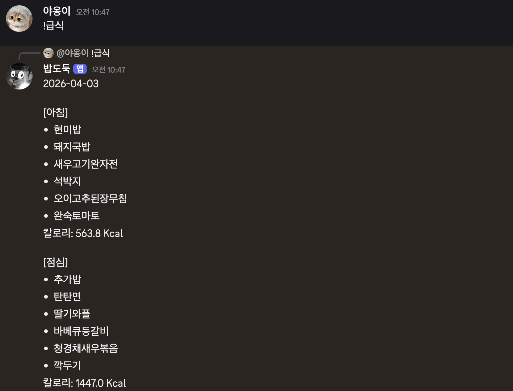

# DGSW_meal_bot

디스코드에서 `!아침`, `!점심`, `!저녁`, `!급식`, `!내일급식` 명령어로  
학교 급식 정보를 조회하는 봇입니다.

---

## 기능

- `!아침` → 오늘 아침 급식 조회
- `!점심` → 오늘 점심 급식 조회
- `!저녁` → 오늘 저녁 급식 조회
- `!급식` → 오늘 전체 급식 조회
- `!내일급식` → 내일 전체 급식 조회

---

## 사용 기술

- Node.js
- discord.js
- axios
- dotenv

---

## 디스코드 봇 초대 링크
https://discord.com/oauth2/authorize?client_id=1489144405087617144&permissions=2048&integration_type=0&scope=bot+applications.commands

---

## 사용 예시

  

